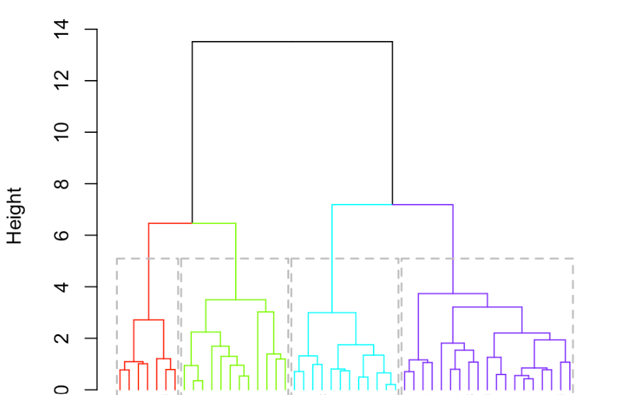

# Unsupervised Learning Analysis on Italian Regional Habits and Living Conditions

This repository contains the code and analysis performed for an unsupervised learning project aimed at understanding the clustering and patterns of habits and living conditions across Italian regions in 2019.

## Project Structure

- **`MatteoCiarrocchi_UnsupervisedLearning_Code.R`**: R script implementing PCA and clustering techniques for the analysis.
- **`MatteoCiarrocchi_UnsupervisedLearning_Report.pdf`**: Detailed report summarizing the problem, methodology, and results.

## Key Objectives

1. Perform a low-dimensional visualization of Italian regional data using **Principal Component Analysis (PCA)**.
2. Detect clusters among the regions using **Hierarchical Clustering**.
3. Understand regional differences in habits and living conditions based on variables such as smoking, drinking, income, and education.

## Dataset

- The analysis uses data from **Istat (2019)** at the regional level.
- Key variables include:
  - **Habits**: Smoking, drinking frequency (e.g., wine, beer, liquor).
  - **Economic and Social Indicators**: Income, education level, quality of life satisfaction.
  - Data was preprocessed and scaled for PCA and clustering.

## Methodology

### Principal Component Analysis (PCA)
- Reduced dataset dimensions using eigenvalues and eigenvectors.
- Visualized the data in 3D space, explaining ~65% of the variance with the first three components.
- Identified influential variables for each principal component.

### Clustering
- Applied hierarchical clustering with different linkage methods:
  - **Average Linkage**
  - **Complete Linkage**
  - **Ward Linkage**
- Optimal cluster count was determined using the **Elbow Method**.
- The final clustering highlighted three main groups:
  - **Cluster 1**: Regions with lower income and less healthy habits.
  - **Cluster 2**: Autonomous provinces with higher income, better health indicators, and higher satisfaction.
  - **Cluster 3**: Regions with intermediate conditions.

## Results

- PCA provided a clear visualization of the regional differences.
- Clustering revealed significant divisions aligned with geographical and socioeconomic factors.
- **Cluster 2** (autonomous provinces) had the best living conditions and habits.
- **Cluster 1** (southern regions) faced challenges such as lower income and unhealthy habits.

For a proper presetation, feel free to delve into **`unsupervised presentation.pdf`**!
